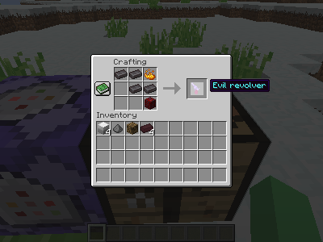
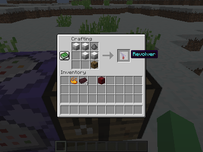
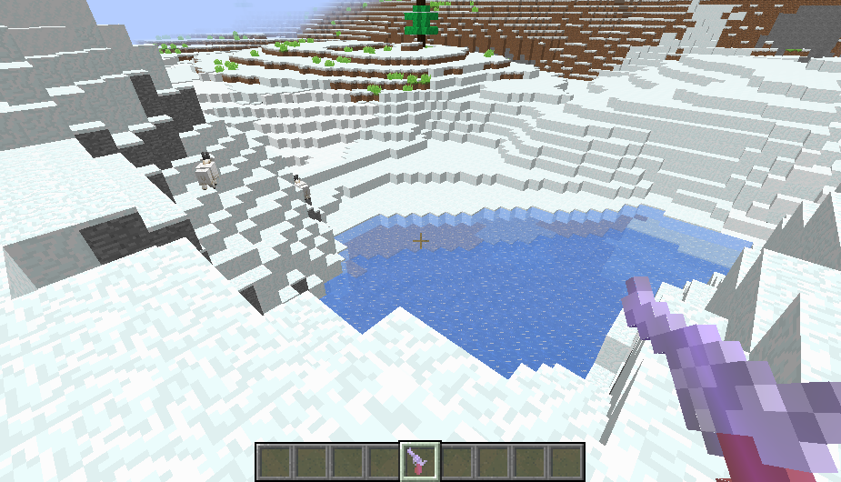
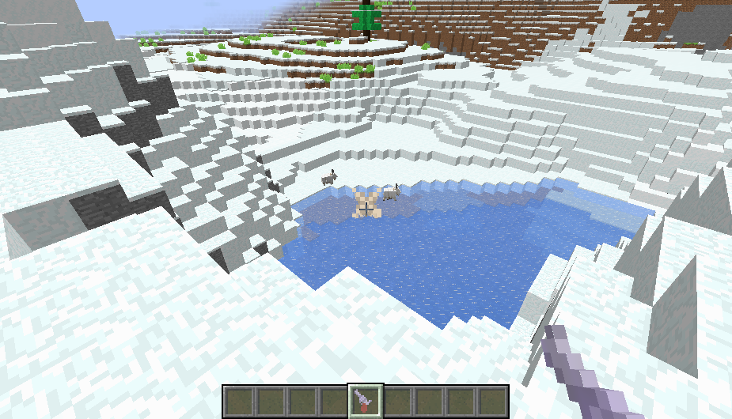
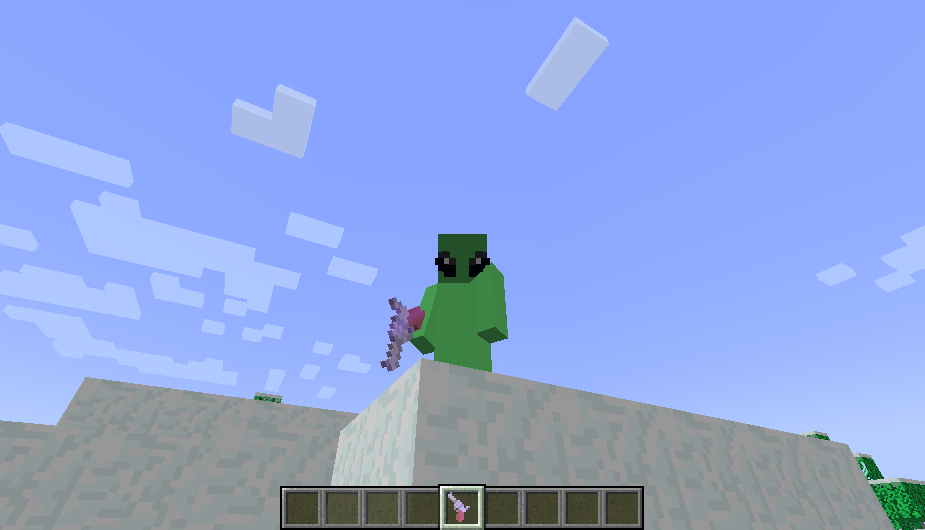
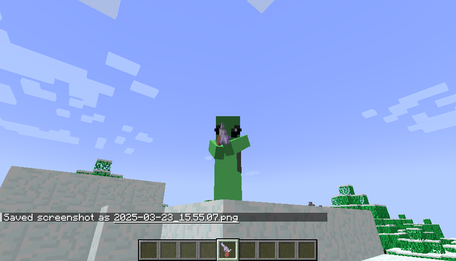
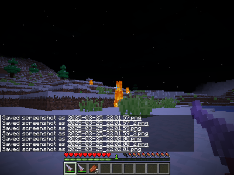

# 1.21.4

## Usage

The gun shoots arrows, first right click cocks and second fires.

## Install

### Linux 

First, `git clone https://github.com/trmaa/minecraft_revolver_mod.git && cd minecraft_revolver_mod/`.
Then do `cp -r ./* ~/.minecraft/resourcepacks/revolver/` and `cp -r ./* ~/.minecraft/saves/<your_world>/datapacks/revolver/`.

### Windows 

If you shit yourself in the pants while are a masochist, therfore: use windows to play minecraft (who knows why), .minecraft/ directory (folder for turds) might be at `C:\User\<PieceOfShit>\AppData\Roaming\`... you paste the files of the repo at... I do not want to help you... Go away, please!
